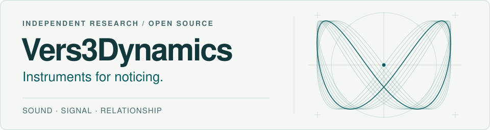

<picture>
  <source media="(prefers-color-scheme: dark)" srcset="assets/resonance-dark.svg">
  <source media="(prefers-color-scheme: light)" srcset="assets/resonance-light.svg">
  
</picture>

# Christopher Woodyard

**Researcher, musician, artist. Founder + CEO of [Vers3Dynamics](https://vers3dynamics.com/).** 
Washington, DC metro

I build instruments for noticing: software and experimental hardware that make changing relationships between signals easier to see, hear, and question.

At Vers3Dynamics, I explore **resonant intelligence** through biosignal research, adaptive systems, and sound. The question running through the work: how can a system respond to change while preserving the person's ability to understand and choose?

**Resonance as Substrate. Intelligence as a Layer.**

[Visit the lab](https://vers3dynamics.com/) · [Explore the work](#start-here) · [Music](https://chriswoodyard.bandcamp.com/) · [Support the lab](https://ko-fi.com/vers3dynamics)

## Start here

### [R.A.I.N. Lab](https://github.com/topherchris420/james_library) · Research orchestration

The research brain of the lab: a local-first, multi-agent environment for investigating questions, comparing explanations, and retaining evidence. Model proposals pass through host-controlled policy; recorded decisions can be inspected and replayed.

[Explore the research interface](https://rainlabteam.vercel.app/) · [Inspect the decision architecture](https://github.com/topherchris420/james_library/blob/main/docs/bounded-decisions.md)

### [Dynamic Resonance Rooting](https://github.com/topherchris420/dynamic-resonance-rooting) · Signal analysis

A Python framework for examining rhythms, lagged relationships, and structural changes in multivariate time series. Start with a seeded oscillator experiment, then inspect the external benchmark—including the result that did not support its preregistered claim.

[Run the example](https://github.com/topherchris420/dynamic-resonance-rooting#quick-start) · [Read the evidence](https://github.com/topherchris420/dynamic-resonance-rooting/blob/main/docs/external-evidence.md)

### [CIRCLE](https://github.com/topherchris420/circle) · Biosignal instrumentation

An experimental hardware architecture for synchronized physiological sensing, local recording, and haptic feedback. Schematics, provenance contracts, and review gates make the design inspectable. **Engineering review stage; not cleared for fabrication or human connection.**

[Explore the architecture](https://github.com/topherchris420/circle#hardware-architecture--resonance-assembly) · [Inspect the review gates](https://github.com/topherchris420/circle/blob/main/docs/review-gates.md)

## More from the lab

| Project | What you can explore |
| --- | --- |
| [Anna](https://github.com/topherchris420/anna) | Self-hostable research search with hybrid retrieval, inspectable source passages, and portable research records. |
| [IONS-X](https://github.com/topherchris420/ions-x-deep-emergence-lab) | Collective-sensing simulations with paired synthetic controls and reproducible experiment records. |
| [Lop Nur Twin / Blacksite](https://github.com/topherchris420/lop-nur-twin) | A browser-based spatial reconstruction from public imagery, with evidence-linked geometry and a separate fictional game mode. |

## How I work

- **Make the evidence inspectable.** Keep observations, model outputs, and hypotheses distinguishable.
- **Give ideas a way to fail.** Use controls, baselines, and reproducible experiments; publish limitations alongside results.
- **Keep people in the loop.** Make feedback understandable and consequential decisions reviewable.

My tools span Python and numerical computing, TypeScript and browser interfaces, real-time audio, and 3D visualization. Music, photography, painting, and poetry are part of the same practice: paying closer attention.

If you work on biosignals, research infrastructure, signal analysis, or creative instruments, start with a project above. Reproduce an experiment, question an assumption, or open an issue with a concrete idea.

---

> I create because the alternative feels impossible: to let a day happen without fully noticing that it happened.

**Built by one researcher. Open to whoever wants to explore.**

  
Contribution flow

  
The day-to-day work, drawn from public GitHub contributions.

  

