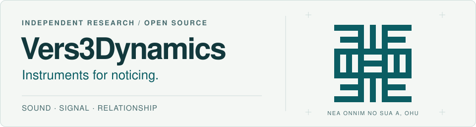
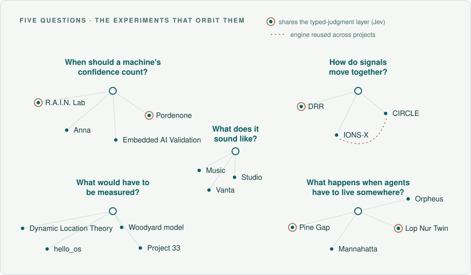
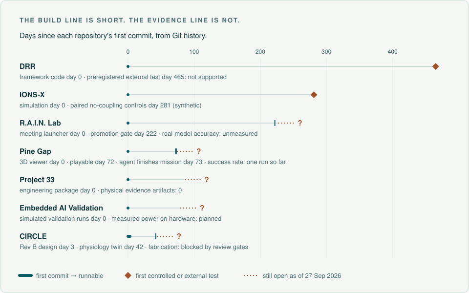

<picture>
  <source media="(prefers-color-scheme: dark)" srcset="assets/resonance-dark.svg">
  <source media="(prefers-color-scheme: light)" srcset="assets/resonance-light.svg">
  
</picture>

# Christopher Woodyard

**Researcher · musician · artist** 
Founder of [Vers3Dynamics](https://vers3dynamics.com/), an open-source resonant intelligence lab · Washington, DC metro

I build instruments for noticing: software, simulations, and experimental hardware for relationships that are hard to see directly — between signals, models, environments, bodies, decisions, and time.

AI has made implementation cheap enough that one person can now attempt what used to take a team. It has not made evidence any cheaper. So the lab runs on one rule:

**Maximum conceptual ambition. Minimum credible experiment.**

Build toward the experiment as fast as the tools allow. Then slow down, and let the result decide what the idea gets to claim.

[The questions](#what-im-trying-to-find-out) · [The ledger](#where-each-experiment-stands) · [Build time vs. evidence time](#unreasonably-fast-deliberately-bounded) · [What didn't survive](#what-didnt-survive-contact) · [Earlier strata](#earlier-experiments) · [Music](https://chriswoodyard.bandcamp.com/)

## What I'm trying to find out

The repositories look scattered. They orbit a handful of questions.

<picture>
  <source media="(prefers-color-scheme: dark)" srcset="assets/constellations-dark.svg">
  <source media="(prefers-color-scheme: light)" srcset="assets/constellations-light.svg">
  
</picture>

Seen together, one pattern keeps returning in software, hardware, and games alike: a hard line between what a system *proposes* and what is allowed to *count*.

### When should a machine's confidence count?

A model may search, argue, score, or propose. Something inspectable decides what counts — a host policy, a deterministic check, a citation, a release gate — and the decision can be replayed.

- **[R.A.I.N. Lab](https://github.com/topherchris420/james_library)** — the lab's research environment. Four agents argue a question from papers and evidence; model proposals pass through host-controlled policy; recorded decisions replay without inference. [Try it](https://rainlabteam.vercel.app/) · [how decisions are bounded](https://github.com/topherchris420/james_library/blob/main/docs/bounded-decisions.md)
- **[Pordenone](https://github.com/topherchris420/resonate-ai-mesh)** — the same rule stripped to its skeleton: a deterministic hard check before any optional model check, and sessions that replay with no network.
- **[Anna](https://github.com/topherchris420/anna)** — self-hostable research search built on the architecture of Anna's Archive: hybrid retrieval, exact source offsets, and an explicit refusal when the evidence isn't there.
- **[Embedded AI Validation](https://github.com/topherchris420/embedded-ai-validation-platform)** — continuous integration for edge-AI firmware, where every metric is labelled measured, simulated, estimated, or mock before it can inform a release verdict.

### How do signals move together?

Rhythm, lag, and coupling between changing signals — each project ships with a null or a control, so a pattern can be told apart from the wish for one.

- **[Dynamic Resonance Rooting](https://github.com/topherchris420/dynamic-resonance-rooting)** — rhythms, lead–lag relationships, and structural change in multivariate time series. Its preregistered external test came back *not supported*, and the README reports that as plainly as the successes. [Read the evidence](https://github.com/topherchris420/dynamic-resonance-rooting/blob/main/docs/external-evidence.md)
- **[CIRCLE](https://github.com/topherchris420/circle)** — a biosignal instrument design: skin conductance, pulse, motion, and haptic feedback under one timing and provenance model. No board has been built; a seeded physiological twin exercises the pipeline and the closed loop. Not cleared for fabrication or human connection. [Review gates](https://github.com/topherchris420/circle/blob/main/docs/review-gates.md)
- **[IONS-X](https://github.com/topherchris420/ions-x-deep-emergence-lab)** — sensing agents in a changing field, run in pairs with the coupling removed, to ask what the detector finds when there is nothing to find.

### What happens when agents have to live somewhere?

Places rebuilt from public sources as worlds with physics, with fact and fiction labelled, where an agent acts through the same controls a person uses.

- **[Pine Gap: After Hours](https://github.com/topherchris420/satellite-vision-scape)** — a browser 3D world where a person and an AI agent play the same mission under the same physics, and every action is traced. *The agent chooses what to try. The simulation decides what happens.* [Play it](https://geotwn.vercel.app)
- **[Lop Nur Twin](https://github.com/topherchris420/lop-nur-twin)** — Earth-observation imagery turned into an explorable airfield model with a source ledger, confidence filters, and release diffs, plus a game on the same geometry that is labelled as fiction.
- **[Mannahatta](https://github.com/topherchris420/cognisync-terrain-weaver)** — how a city block absorbs a storm, compared with the island's 1609 landscape. Draw green infrastructure and route the same storm again. Planning estimates, with the model's limits written down.
- **[Orpheus](https://github.com/topherchris420/orpheus-resonance-protocol)** — a control-room interface study. The only real input is local microphone energy, and the interface says exactly that.

### What would have to be measured?

Speculative ideas written precisely enough to fail, beside code that says which parts are analytical, synthetic, or untested. Papers here are meant to become executable, and executable things are meant to meet an instrument.

- **[Dynamic Location Theory](https://github.com/topherchris420/research)** — a paper proposing that position is encoded in a system's resonance with a background scalar field, with predictions for atomic-clock and matter-wave interferometry. A proposal, not a result. [Paper](https://github.com/topherchris420/research/blob/master/137.pdf) · [DOI](https://doi.org/10.5281/zenodo.18263032)
- **[Woodyard model workstation](https://github.com/topherchris420/waveform-shift-quantum)** — simulates a proposed scalar-field localization model beside standard quantum baselines, and states the measurement that would reject it.
- **[hello_os](https://github.com/topherchris420/ideas)** — a toy model of gravitomagnetic rotor arrays: synthetic detector traces and design sweeps bounded by material stress.
- **[Project 33](https://github.com/topherchris420/33)** — a low-cost folding-fin rocket testbed: simulation, CAD, ESP32 firmware, an interlocked launcher. Its evidence catalog lists zero physical artifacts and four unresolved claims, in plain view. No flight is claimed.

### What does it sound like?

Music, photography, painting, and poetry are the same practice: paying closer attention.

- **[Music](https://chriswoodyard.bandcamp.com/)** — recordings on Bandcamp.
- **[Vers3Dynamics Studio](https://github.com/topherchris420/quantum-spin-sound)** — live-coded music with Strudel and audio-reactive visuals.
- **[Vanta](https://github.com/topherchris420/vanta)** — the portfolio as an instrument. *Five notes. One chord.* Writing, software, art, frequency, and music tuned from one signal, with a research atlas that states what its catalog does not verify.

## Where each experiment stands

A deployment is not validation. A simulation is not a measurement. Code existing is not evidence existing.

`CONCEIVED` → `BUILDING` → `EXECUTABLE` → `OBSERVED` → `REPRODUCED` → `SUPPORTED` — and `NOT SUPPORTED`, which stays on the page.

| Experiment | Stands at | What would move it |
| --- | --- | --- |
| Dynamic Resonance Rooting | `OBSERVED` synthetic · `NOT SUPPORTED` external | a preregistered external comparison that holds its false-alarm tolerance |
| CIRCLE | `OBSERVED` simulated twin · hardware `BUILDING` | review gates closed, a fabricated board, a bench measurement |
| IONS-X | `OBSERVED` synthetic field | the paired-control design applied to recorded data |
| R.A.I.N. Lab | `EXECUTABLE` | measured accuracy of real models behind the decision gate |
| Pine Gap | `EXECUTABLE` · one recorded agent run | repeated agent runs and a success rate |
| Project 33 | `BUILDING` · bench prototype | the first physical evidence artifact |
| Dynamic Location Theory | `CONCEIVED` · predictions untested | an interferometry measurement that could reject it |

Nothing here is `REPRODUCED` or `SUPPORTED` yet. The full ledger, with sources for every state, is in [`experiments/`](experiments/README.md).

## Unreasonably fast. Deliberately bounded.

<picture>
  <source media="(prefers-color-scheme: dark)" srcset="assets/latency-dark.svg">
  <source media="(prefers-color-scheme: light)" srcset="assets/latency-light.svg">
  
</picture>

Dates come from Git. Git records when work was committed, not when it was imagined; a repository that opens with an upload is hiding whatever came before it.

AI shortens the path to a runnable thing: interfaces, simulators, test harnesses, schematics, documentation. It does not shorten the path from a runnable thing to a trustworthy one. [CIRCLE](https://github.com/topherchris420/circle) went from first commit to a Rev B electronics package in three days; fabrication and a single human measurement are still ahead of it. [DRR](https://github.com/topherchris420/dynamic-resonance-rooting) committed its framework code on day one; its first preregistered external test came 465 days later, and did not support the claim.

The record of how long each step took is kept in [**Unreasonably Fast**](experiments/unreasonably-fast.md).

**The 72-hour question.** *If a meaningful version had to exist within 72 hours, what would we actually need to build?* It is not a deadline. It forces a large idea to collapse into a small experiment — and "this needs six months" is a legitimate answer, because it is still information. The point is not speed. It is learning sooner.

**[Impossible six months ago →](experiments/impossible-six-months-ago.md)** A running list of things that recently moved from impractical to attemptable for one person, and what each still cannot tell us.

## What didn't survive contact

Discarded approaches are part of the record.

- **A structural-change claim.** On the NOAA quasi-biennial oscillation series, DRR's false-alarm rate exceeded its preregistered tolerance. The claim is recorded as `not_supported`. [Protocol and result](https://github.com/topherchris420/dynamic-resonance-rooting/blob/main/DRR_VALIDATION_REPORT.md)
- **Two firmware assumptions.** Before any board existed, CIRCLE's physiological twin showed that the ADC has no native 64 SPS mode and that optical timestamps must anchor to the FIFO interrupt, not the read.
- **A spring margin.** Project 33 states a requirement of at least 20% margin for its torsion spring; the calculation reports 19%. The claim stays marked unresolved.
- **An agent's habits.** Pine Gap's traces showed that none of 79 mid-route reviews changed the agent's plan, and that many calls were spent choosing to wait. Tasks can now say when they are playing themselves out; on the same mission, calls fell from 212 to 155.
- **The language of 2025.** Early prototypes described "operational" wormhole stabilization and teleportation fidelity above 99.5%. That language did not survive into the current work. One question under it — can location be described as a resonance? — became a paper with testable predictions.

## Earlier experiments

The archive is kept in view, as strata rather than clutter. [**Read the strata →**](experiments/archive.md)

- **2024 — first contact.** Chat apps on fast inference. One README's headline was simply that it was *blazing fast*.
- **2025 — the generative burst.** Two dozen prototypes started between May and August, most built largely through an AI app builder: wormholes, soul prints, teleportation, time perception. Early forms of DRR, of location-as-resonance, and of biosignal feedback all appear here.
- **2026 — the evidence turn.** Preregistration, review gates, provenance labels, replay. Some of the old prototypes were rewritten to say what they are before being archived.

Not every idea becomes a product. Some become evidence. Some become parts of later systems. Some are dead ends. Some were simply worth trying.

## How I work

- **Attempt it before it feels reasonable.** Then build the smallest version that can answer something.
- **Use AI aggressively for implementation.** Never mistake implementation for evidence.
- **Make the evidence inspectable.** Keep observations, model outputs, and hypotheses distinguishable.
- **Give ideas a way to fail.** Controls, baselines, preregistration; limitations published beside results.
- **Keep people in the loop.** Confidence is not authority. Consequential decisions stay reviewable.
- **Publish what happened.** Then try again.

**Resonance as Substrate. Intelligence as a Layer.**

If you work on biosignals, research infrastructure, signal analysis, agent environments, or creative instruments, start anywhere above. Reproduce an experiment, question an assumption, or open an issue with a concrete idea.

---

> I create because the alternative feels impossible: to let a day happen without fully noticing that it happened.

**One person, a great many agents, and the open-source work this stands on.** [Support the lab](https://ko-fi.com/vers3dynamics)
